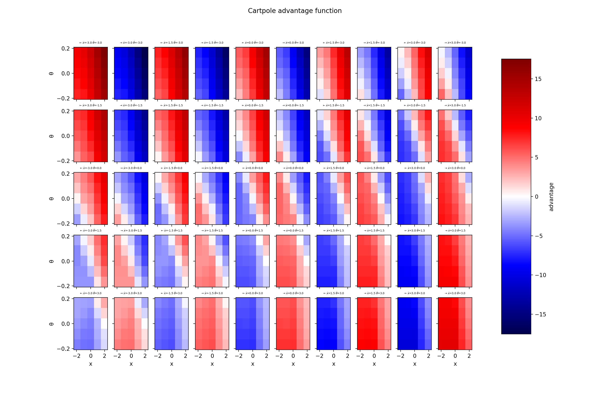
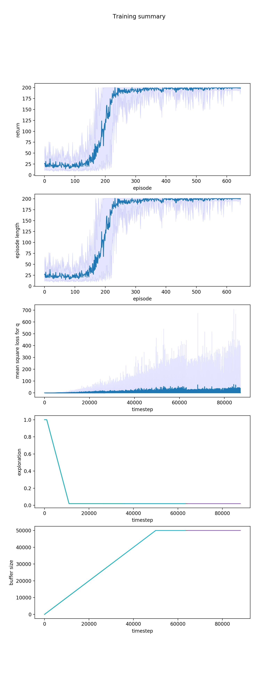
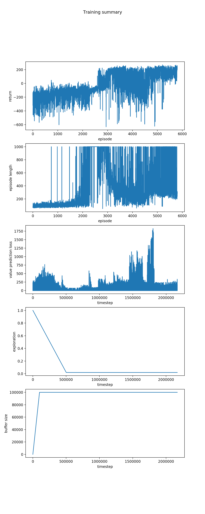
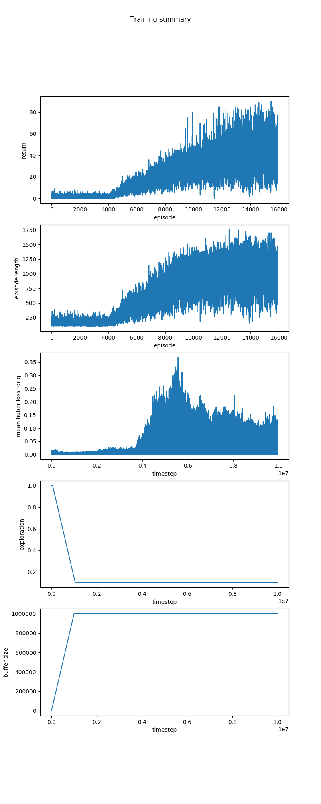

# nevermind

Implementation of the original Deep Q-network algorithm from [Mnih et al. 2015](https://storage.googleapis.com/deepmind-media/dqn/DQNNaturePaper.pdf).

## Installation

Python 3.6+ and [TensorFlow](https://www.tensorflow.org/install/) are required.

    pip3 install git+git@github.com:JuliusKunze/nevermind.git

will install nevermind together with minimal requirements.

## Run

Solve the [cartpole](https://gym.openai.com/envs/CartPole-v0/) gym environments in a few minutes on a CPU:

```python
from nevermind import configurations
    
configurations.train_cartpole()
```

Train for the [lunar lander](https://gym.openai.com/envs/LunarLander-v2/) environment - typically solved in a few hours on a CPU:

```python
configurations.train_lunar_lander()
```

Training for the Atari 2600 game [breakout](https://gym.openai.com/envs/Breakout-v0/) takes days on a GPU: 

```python
configurations.train_atari(game='breakout')
```

Models and training summary plots (see below) are saved to the directory `./data` by default.

## Results

Learned value and advantage function for the cartpole task:




Cartpole training summary of 10 runs:


Summary of a successful lunar lander training run:


10M timesteps of training for the breakout Atari environment:
